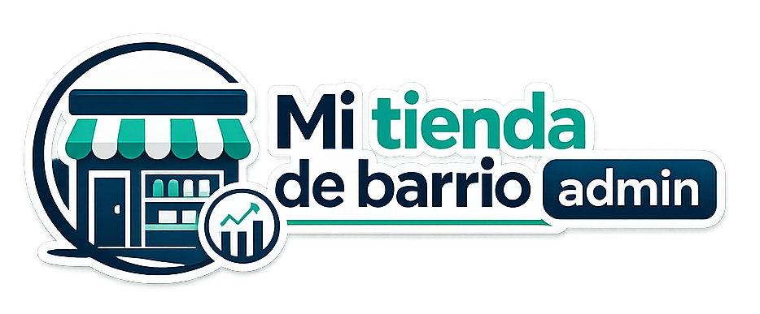
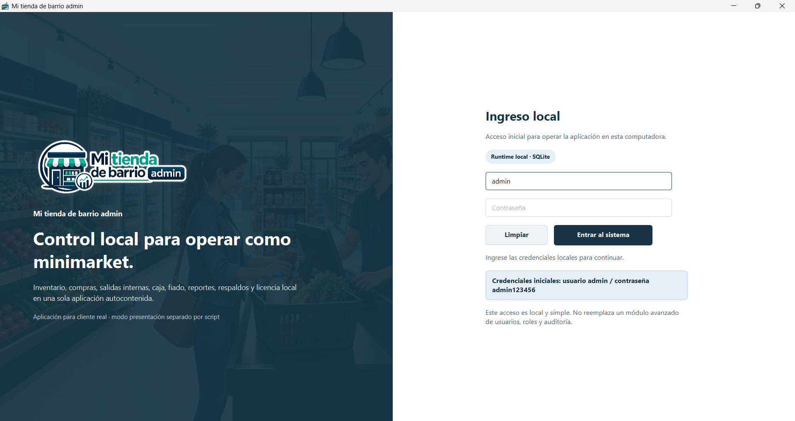
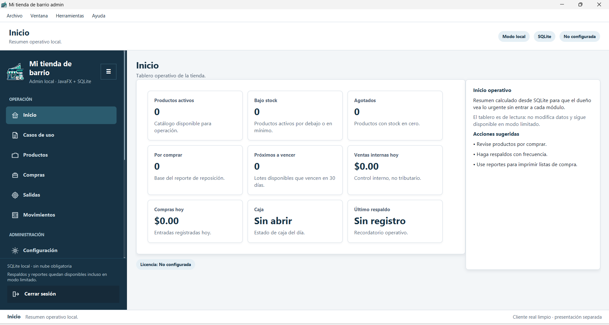
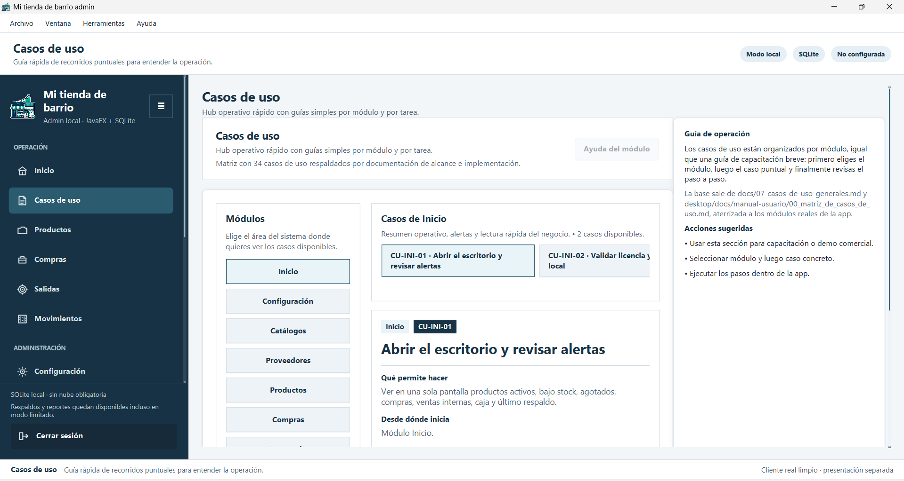

<p align="center">
  
</p>

# Mi tienda de barrio admin

**Control local para tiendas de barrio, despensas, víveres y pequeños minimarkets que quieren ordenar su operación sin depender de nube obligatoria.**

Mi tienda de barrio admin está pensado para negocios que ya no quieren manejar todo en cuaderno, memoria, notas sueltas o archivos de Excel improvisados. La idea es simple: ayudar al dueño a saber qué tiene, qué falta comprar, qué se movió, qué proveedor abasteció, qué cliente debe fiado y cuándo conviene respaldar la información.

Es una aplicación de escritorio para una computadora principal del local. No intenta reemplazar la facturación electrónica ni la contabilidad formal; funciona como **control operativo interno** para inventario, reposición, compras, salidas, caja, fiado, reportes y respaldos.

---

## De tienda de barrio a minimarket ordenado

Una tienda pequeña crece cuando empieza a controlar mejor sus productos, su reposición y su efectivo diario. Este sistema apunta justamente a esa transición: pasar de “vendo y repongo como puedo” a operar con una base de productos, proveedores, movimientos y reportes.

El rubro de tienda/despensa necesita resolver problemas cotidianos:

- productos que se agotan y nadie se da cuenta a tiempo;
- compras al proveedor que no quedan registradas con claridad;
- mercadería que entra, sale, se daña, vence o se pierde;
- precios de referencia y costos de compra que se olvidan;
- clientes que compran fiado y luego no se recuerda bien el saldo;
- caja diaria que se mezcla con gastos pequeños del local;
- falta de respaldos ante apagones, daño de equipo o errores humanos.

Mi tienda de barrio admin no promete convertir una tienda en supermercado de golpe. Su propuesta es más concreta: **dar orden operativo local para que el negocio pueda crecer con menos improvisación**.

---

## Qué permite controlar

### Inventario y reposición

- Catálogo de productos activos e inactivos.
- Stock actual, stock mínimo y stock objetivo.
- Alertas de bajo stock, agotados y productos por comprar.
- Categorías, marcas, unidades y presentación del producto.
- Productos con vencimiento o condiciones especiales como refrigeración.

### Proveedores y compras

- Registro de proveedores frecuentes.
- Entradas de mercadería por compra o recepción.
- Costo unitario referencial.
- Comprobante, lote, fecha y observaciones.
- Historial útil para saber de dónde vino la mercadería.

### Salidas y movimientos

- Salidas internas no tributarias para descargar stock.
- Ajustes por conteo físico, merma, daño o vencimiento.
- Trazabilidad del stock anterior y stock nuevo.
- Registro humano de motivo, responsable y observación.

### Caja, fiado y respaldo

- Caja diaria opcional para ingresos, egresos y cierre operativo.
- Clientes de fiado, cuentas abiertas y abonos.
- Respaldos locales para proteger la base SQLite.
- Reportes para revisar productos por comprar, bajo stock, vencimientos y movimientos recientes.

---

## Pantallas principales

### Ingreso local



La pantalla de ingreso comunica que el sistema es local, instalado en la computadora del negocio y listo para operar con SQLite. La zona visual usa una imagen de minimarket para reforzar la idea de crecimiento: una tienda de barrio que empieza a trabajar con más orden, inventario y atención al cliente.

El acceso inicial mantiene credenciales simples para la primera instalación o capacitación. En un cliente real, estas credenciales deben cambiarse o evolucionar a un módulo de usuarios si el alcance comercial lo requiere.

### Inicio operativo



El inicio funciona como tablero de lectura rápida. No obliga al dueño a entrar a cada módulo para enterarse de lo urgente. Resume productos activos, bajo stock, agotados, productos por comprar, vencimientos cercanos, ventas internas del día, compras del día, caja y último respaldo.

Este tablero es útil para la rutina diaria del local: abrir el sistema, mirar alertas, decidir qué reponer y revisar si conviene respaldar información.

### Casos de uso



El módulo de casos de uso sirve como guía de operación. No es un manual largo: es un hub rápido para elegir un módulo, seleccionar una tarea concreta y revisar qué permite hacer, desde dónde inicia, pasos exactos y resultado esperado.

Para un cliente, esta pantalla funciona como capacitación integrada. Para el repositorio, funciona como evidencia de alcance: cada caso de uso aterriza una necesidad real del negocio en un flujo operativo del sistema.

---

## Ruta comercial para clientes

Este producto se puede presentar como una solución local para tiendas pequeñas y medianas que quieren profesionalizarse sin pagar infraestructura excesiva.

La vía recomendada de entrega a cliente es:

1. Instalar la aplicación en la computadora principal del local.
2. Configurar datos del negocio: nombre comercial, responsable, teléfono, dirección, actividad y moneda.
3. Cargar catálogos base: categorías, marcas y unidades.
4. Registrar proveedores principales.
5. Cargar productos reales del negocio.
6. Registrar compras y salidas con acompañamiento inicial.
7. Crear un primer respaldo local.
8. Capacitar usando Casos de uso y Ayuda contextual.

También se conserva una vía de presentación separada: el repositorio puede incluir scripts de datos de presentación para mostrar el sistema con información inventada, igual que amoblar una casa antes de enseñarla. Esa información no debe mezclarse con los datos reales del cliente.

---

## Módulos incluidos

- **Configuración:** identidad del negocio y datos usados en reportes.
- **Catálogos:** categorías, marcas y unidades reutilizables.
- **Proveedores:** fuentes de abastecimiento y contacto comercial.
- **Productos:** catálogo maestro, stock, precios de referencia y alertas.
- **Compras:** entrada de mercadería y actualización de stock.
- **Salidas:** descarga operativa de stock sin reemplazar facturación.
- **Movimientos:** ajustes, mermas y trazabilidad de inventario.
- **Caja:** control diario opcional de efectivo.
- **Fiado:** clientes, cuentas por cobrar y abonos simples.
- **Reportes:** consultas operativas para reposición y control.
- **Respaldos:** copias locales de seguridad.
- **Licencia:** activación local y modo limitado ético.
- **Ayuda / Casos de uso:** capacitación integrada para usuario final.

---

## Alcance honesto

Mi tienda de barrio admin **no es** facturación electrónica, no reemplaza al SRI, no reemplaza asesoría contable, no es ERP corporativo, no es sistema multi-sucursal y no depende de nube obligatoria.

Su nicho es otro: **control operativo local para negocios que están creciendo y necesitan orden antes de saltar a sistemas más grandes**.

---

## Para desarrollo y GitHub

### Stack técnico

- **Java:** Eclipse Temurin JDK 21.
- **Build:** Maven con Maven Toolchain configurado en la máquina del desarrollador.
- **UI:** JavaFX.
- **Base local:** SQLite.
- **Arquitectura:** aplicación autocontenida con separación interna entre UI, aplicación, dominio e infraestructura.

No se debe modificar el `toolchains.xml` del usuario. El proyecto asume que el entorno local ya tiene configurado Maven Toolchain para usar Java 21.

### Comandos útiles

```bat
scripts\dev-desktop.bat
```

```bat
scripts\validate-desktop.bat
```

### Estado de estabilización

Completado en las primeras tandas de nivelación:

- branding inicial con logo e imagen de login;
- login visualmente comercial;
- shell con sidebar, menubar y statusbar;
- botón de cerrar sesión en footer lateral;
- icono de aplicación;
- casos de uso como hub operativo;
- README propagandístico orientado primero al cliente y luego al desarrollador.

Pendiente para siguientes tandas:

- **R3:** refactor de componentes visuales reutilizables.
- **R4:** terminar de mover catálogo de casos de uso a capa de aplicación si aún queda código funcional dentro de UI.
- **R5:** limpiar repetición en repositorios SQLite.
- **R6:** separar formularios grandes por pantalla.
- **R7:** dividir CSS en tokens, shell, componentes, módulos, login y casos de uso.

---

## Idea central

**Más orden que un cuaderno. Más simple que un ERP. Más práctico que depender de internet para todo.**

Mi tienda de barrio admin es una base de software empresarial local para negocios de víveres que quieren crecer con control, respaldo y procesos entendibles.
